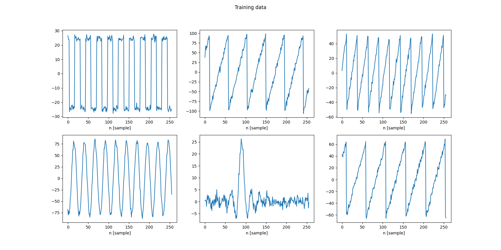
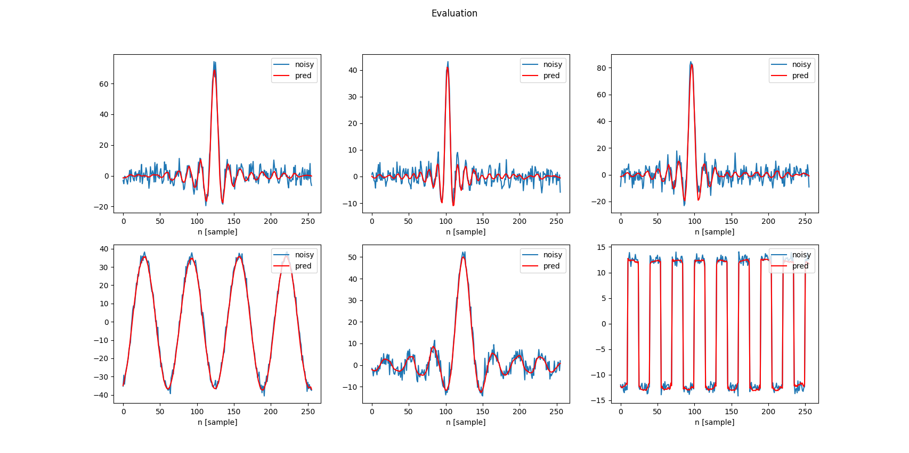
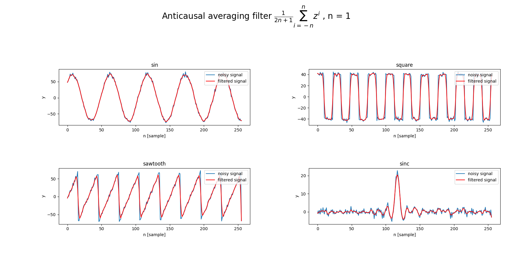

# Time series denoising autoencoder

Training a simple [denoising autoencoder](https://en.wikipedia.org/wiki/Autoencoder) with 1d CNNs.
The training data consisted of sine, square, sawtooth and sinc functions with additive white gaussian noise.

  

The network, consisting of a few convolutional and the same number of transpose convolutional layers,
learns a non-linear filtering function and performs noticeably better than a simple anti-causal average filter.

  

  

