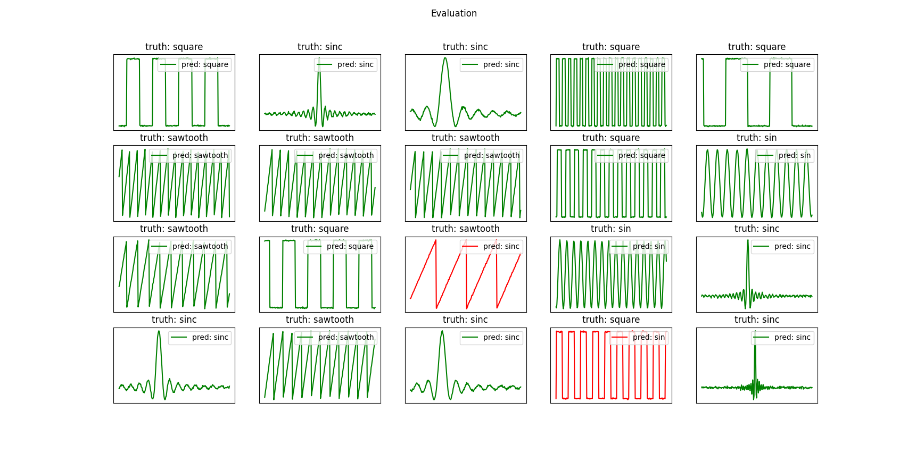

# Time series classification

Training a 1D CNN to classify generated signals. See the details in the _config.yaml_.

The model can achieve close to 99% accuracy. Here are some positive and negative examples:

The dataset was imbalanced and contained the most sinc functions, then sawtooths and square
waves, and finally, the sines were the most underrepresented, and you can tell from the
confusion matrix that it had a big effect on the results. The sincs don't get misclassified
even once, while the sines get mislabeled relatively often.

